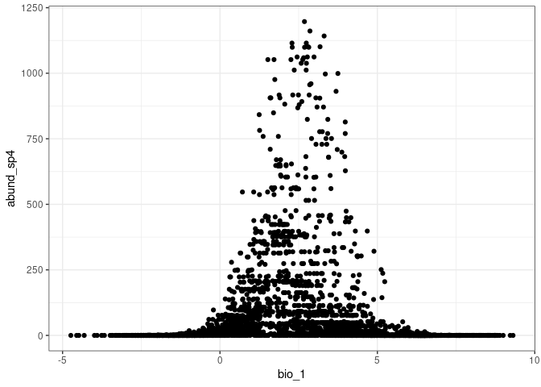

<!-- README.md is generated from README.Rmd. Please edit that file -->

# ExampleReproducibleResearch

<!-- badges: start -->
<!-- badges: end -->

The goal of ExampleReproducibleResearch is to make an example repository
where I will work through examples of reproducible research. I will
explore the species dataset in order to try to find *relationships*
between their abundance and **enviromental variables**.

For exmaple in the following figure we will se the relationship between
the abundance of species 4 and annual mean temperature

In our dataset the number of observatios is 3,500, the mean temperature
in the sites is 2.7
